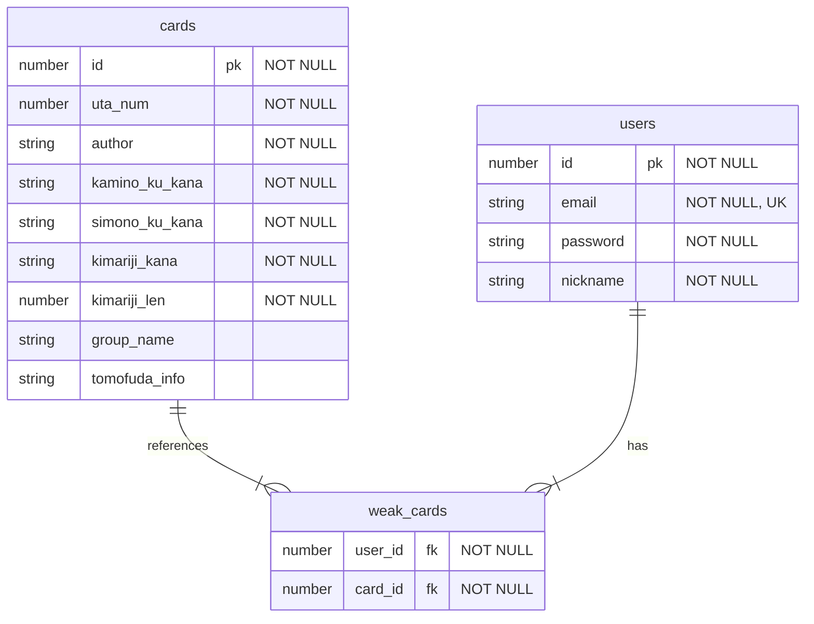

# 競技カルタ練習用アプリ

## 使用技術

- Next.js
- TypeScript
- TailWindCSS
- MySQL

## 機能一覧

- 新規登録
- ログイン認証
- 百人一首の一覧確認
- 覚えにくい苦手札を記録できる機能
- 上の句から下の句を選ぶ 4 択クイズ
- 下の句から決まり字を答えるクイズ
- 競技カルタ時の札配置を覚える練習機能
- 競技カルタを一人で練習できる機能

### 百人一首の一覧確認

- チェックボックスで苦手札のみを表示可能
- 決まり字の表示/非表示の切り替え
- 下の句の表示/非表示の切り替え

### 上の句から下の句を選ぶ 4 択クイズ

- 問題の範囲と、歌順かランダムかの選択可能
- 上の句を一文字ずつ表示していき、競技カルタを意識できる
- 正解数と１問当たりの平均回答時間を表示
- 間違えた問題のみ何回でも再挑戦できる

### 下の句から決まり字を答えるクイズ

- 問題の範囲と、歌順かランダムかの選択可能
- 正解数と１問当たりの平均回答時間を表示
- 問題中でも答えの表示/非表示を切り替えられる
- 間違えた問題のみ何回でも再挑戦できる

### 競技カルタ時の札配置を覚える練習機能

- 自陣と敵陣に並べれた 50 枚の札の決まり字の配置を覚える
- 敵陣の札はさかさまに配置することで、実際の状況を再現
- 非表示の札を選択し、覚えた決まり字を入力する
- 答えを表示/非表示の切り替えも可能

### 競技カルタを一人で練習できる機能

- 自陣と敵陣に並べられた 40 枚の札を取る
- Web Speech API を利用して、上の句を読み上げる
- 正解の札を取ったら、札を非表示

## データベース設計

## プレイ動画

### 百人一首の一覧確認・苦手札の登録

https://github.com/user-attachments/assets/609aa0de-dfb4-47a6-8796-534a72805df0

### 上の句から下の句を選ぶ 4 択クイズ

https://github.com/user-attachments/assets/000500db-70f1-463d-9770-169c976885ab

### 下の句から決まり字を答えるクイズ

https://github.com/user-attachments/assets/72b82a13-861f-45e0-8446-22013fc356c7

### 競技カルタ時の札配置を覚える練習機能

https://github.com/user-attachments/assets/f4b13abd-e3e3-46cb-842e-9397607bcfa1

### 競技カルタを一人で練習できる機能

https://github.com/user-attachments/assets/033a5e64-aa0e-42c6-ac09-65ae08d5b8c8
